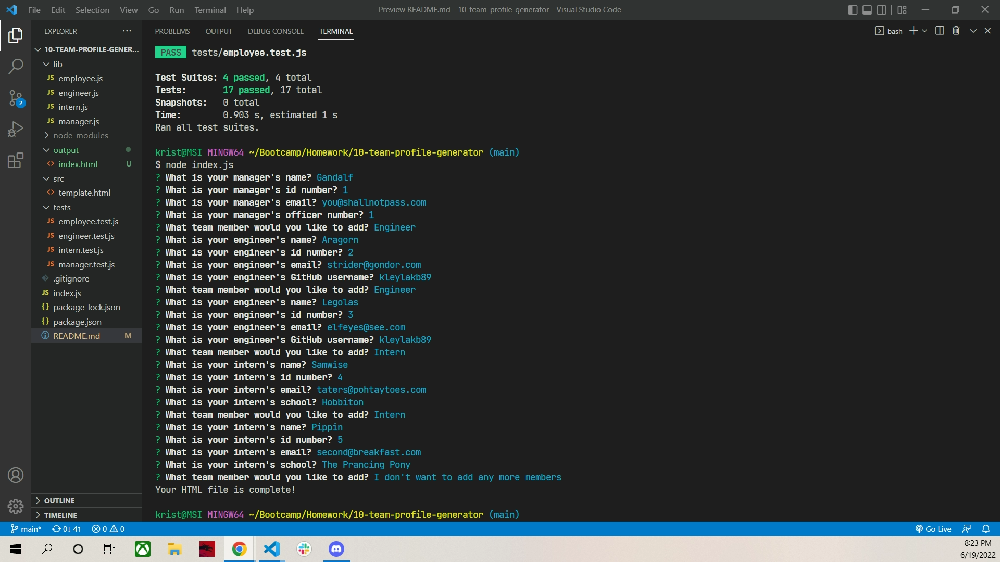
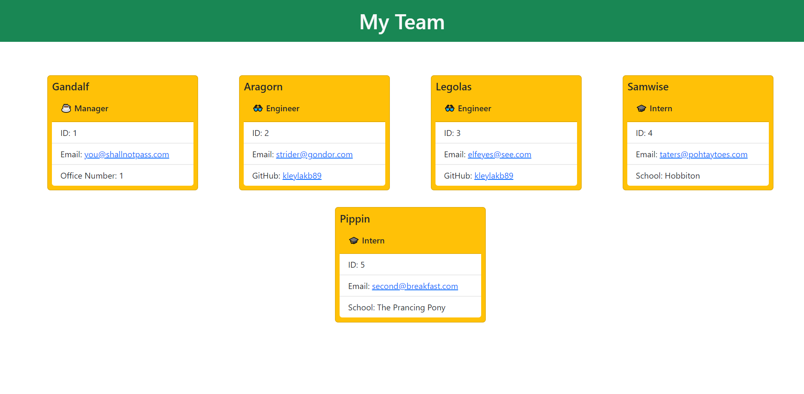

# Team Profile Generator

## Table of Contents

1. [Description](#description)
2. [Usage](#usage)
3. [Visuals](#visuals)
4. [Resources](#resources)

## Description

A JavaScript program that utilizes node.js, inquirer, jest, and OOP to prompt for questions, then take the answers and format them into an HTML file.

Features include:

- Utilizing the file system to write an HTML page that includes Bootstrap cards populated with data about different employees.
- Classes and subclasses that have been tested with jest.
- Inquirer prompts that loop through options until the user no longer wants to add data.
- Links to emails and GitHub pages.

NOTE: The generated HTML file can be found in the output directory.

## Usage

The classes can be tested using 'npm test'. Seeing that they pass, the user can access the program with the command 'node index.js'. Blank answers are not accepted. After inputing a manager, the user will be prompted with a list to select either Engineer, Intern, or none. They can continue entering data about team members until they pick none. After finishing the prompts, an index.html file will be created in the output directory.

## Visuals
An example of the CLI after running the program.

An example of the launched HTML page.

## Resources

- [Repository](https://github.com/kleylakb89/10-team-profile-generator)
- [Video Walkthrough](https://drive.google.com/file/d/1Gq5l47EKXR3OLqTK5qkHoozxd25p5Yvj/view)
- [Generated HTML](https://raw.githubusercontent.com/kleylakb89/10-team-profile-generator/main/output/index.html)